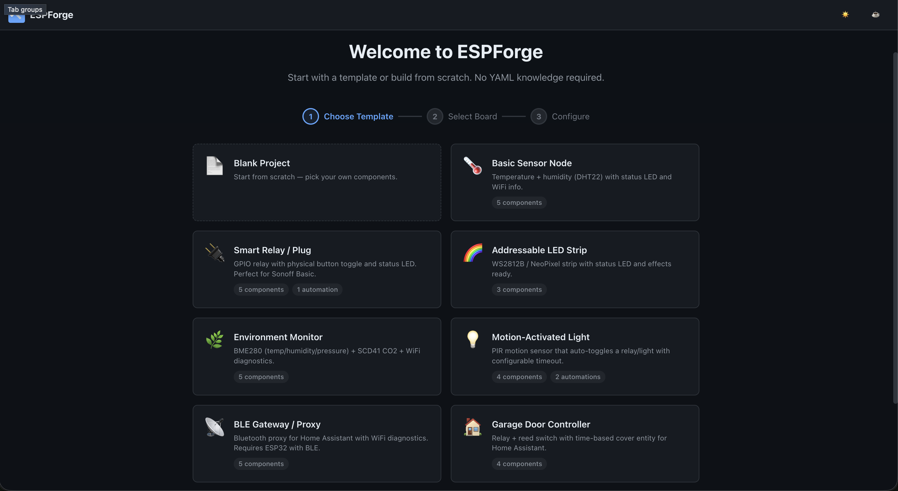

# ESPForge

Visual, browser-based configuration tool for [ESPHome](https://esphome.io/). Pick a board, add components, configure settings — get a ready-to-flash YAML file. No YAML knowledge required.

## Try it here [ESPForge](https://mo3he.github.io/ESPForge/)



## Features

### Build
- **42 boards** — ESP32, S2, S3, C3, C6, ESP8266, plus M5Stack (ATOM Lite, AtomS3, Core2, CoreS3, Cardputer, Dial, StampS3, NanoC6, StickC Plus2), Seeed XIAO (S3, S3 Sense, C6, S2, C3), LilyGO (T-Display S3, T-Display S3 AMOLED, T-Display S3 Pro, T-Beam v1.1, T-Beam Supreme, T-Watch S3, T-Dongle S3), Heltec (WiFi Kit 32, WiFi LoRa 32 v2/v3), CYD (Cheap Yellow Display), Olimex ESP32-PoE, AZ-Delivery, Sonoff, and more
- **98 components** — sensors, switches, lights, fans, covers, locks, climate, BLE, IR, media, displays, I/O expanders, mmWave radar (LD2410, LD2450, LD2411S)
- **10 starter templates** — Blank Project, Sensor Node, Smart Relay, LED Strip, Environment Monitor, Motion Light, BLE Gateway, Garage Door, Power Monitor, Fan Controller
- **Guided onboarding** — template → board → settings → components
- Boards with onboard hardware (buttons, NeoPixels, displays) auto-add those components on selection

### Configure
- **Form-based editing** — every field has labels, defaults, and hints
- **Visual pin mapper** — color-coded board diagram with pin conflict detection
- **Automation builder** — triggers (boot, interval, button press, sensor threshold), conditions, and actions for switches, lights, fans, covers, locks, numbers
- **Full settings** — WiFi, fallback AP, static IP, MQTT, API encryption, OTA, logger levels, SNTP time, status LED

### Import / Export
- **YAML import** — load an existing ESPHome `.yaml` file and keep editing it visually
- **Live YAML preview** — syntax-highlighted, updates as you type
- **Validation** — catches missing WiFi, unassigned pins, empty fields, and conflicts before export
- **Secrets file** — auto-generates `secrets.yaml` for `!secret` references
- **Share via URL** — encode your project in a shareable link

### Quality of life
- Undo / Redo (Ctrl+Z / Ctrl+Shift+Z)
- Save / Load projects as JSON
- Inline project rename in the header
- Light / Dark theme
- Keyboard shortcuts (Ctrl+S save, Ctrl+E export)
- Responsive layout — works on mobile and tablet

## Quick Start

### Home Assistant App

1. In Home Assistant, go to **Settings > Apps > App Store**
2. Click the overflow menu (top right) > **Repositories**
3. Add `https://github.com/mo3he/ESPForge` and click **Add**
4. ESPForge will appear in the store -- install and start it
5. Once installed and started, open it via **Open Web UI** on the app's page

### Docker (easiest)

```bash
docker run -p 8080:80 ghcr.io/mo3he/espforge
```

Or with Docker Compose:

```bash
docker compose up -d
```

Open [http://localhost:8080](http://localhost:8080) in your browser.

To update to the latest image:

```bash
docker compose pull && docker compose up -d
```

Supports `linux/amd64` and `linux/arm64` (Raspberry Pi, Home Assistant OS, etc.).

### Local dev

```bash
cd espforge
npm install
npm run dev
```

Open [http://localhost:5173/ESPForge/](http://localhost:5173/ESPForge/) in your browser.

## Build

```bash
cd espforge
npm run build
```

Static output is in `espforge/dist/`, ready to deploy anywhere.

## Deploy Docker Image

The repo includes a GitHub Actions workflow (`.github/workflows/docker.yml`) that builds and pushes a multi-platform image to `ghcr.io` on every push to `main` and on releases.

## Deploy to GitHub Pages

The repo includes a GitHub Actions workflow (`.github/workflows/deploy.yml`) that builds and deploys on push to `main`:

1. **Settings → Pages** → set Source to **GitHub Actions**
2. Push to `main`

## How it works

ESPForge runs entirely in the browser. Your configuration is never sent to a server. The app builds a structured project in memory and serializes it to valid ESPHome YAML using [js-yaml](https://github.com/nodeca/js-yaml). Share links encode the project as Base64 in the URL hash.

## Tech Stack

- React 19 + TypeScript + Vite 8
- [js-yaml](https://github.com/nodeca/js-yaml)
- No backend — fully static, nothing stored server-side

## Contributing

Issues and PRs welcome. If you'd like to add a board, component, or template, the definitions live in `src/data/`.

## License

MIT
